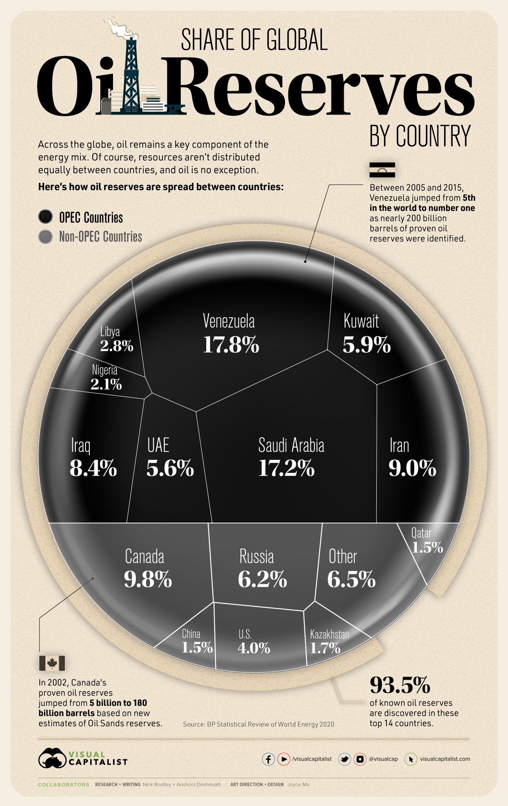

```{r import delle librerie,include=FALSE}
library(tidyverse)
library(shiny)
library(shinyjs)
library(ggrepel)
library(magrittr)
library(readr)
library(ggplot2)
library(treemapify)
devtools::install_github("liamgilbey/ggwaffle")
library(ggwaffle)

```

### Dataset

Si consideri il seguente frammento di grafico pubblicato dal [Visual Capitalist](https://www.visualcapitalist.com/ranking-the-countries-with-the-largest-proven-global-oil-reserves-in-the-world/) che indica la frazione di riserve di petrolio in diversi paesi.



## Design

Riprogettare la visualizzazione in modo da risolvere i problemi evidenziati nell'analisi.


```{r, echo=FALSE}
OPEC_cat <- "OPEC"
nonOPEC_cat <- "non-OPEC"

data <-
  read_csv("data.csv",col_types = cols()) %>%
  mutate(
    Bln_barili=if_else(is.na(Bln_barili), 107*Percentuale/6.2, Bln_barili),
    OPEC=if_else(OPEC, OPEC_cat, nonOPEC_cat)
  )

#Funzione per stampa percentuale con 1 cifra decimale
format_percent = function(x) {
  paste0(format(round(x, 1), nsmall=1), '%')
}


categorie <- c(OPEC_cat, nonOPEC_cat)
checkboxGroupInput("categoria", "Categorie", categorie, categorie)
categoria <- reactive(input$categoria)

filtered_data <- reactive({
  data %>% filter(OPEC %in% categoria())
})

pareto_data <- reactive({
  #Rendo nazione un factor, ordinato per percentuale decrescente +
  #calcolo percentuale progressiva
  filtered_data() %>%
  mutate(Nazione=fct_reorder(Nazione, desc(Percentuale))) %>%
  arrange(Nazione) %>%
  mutate(cumul=cumsum(Percentuale))
})

waffle_data <- reactive({
  filtered_data() %>%
    mutate(
      Nazione=as.character(Nazione),
      Bln_barili=Bln_barili/10
    ) %>%
    slice(rep(1:n(), Bln_barili)) %>%
    waffle_iron(aes_d(group=Nazione))
})
```


### Pareto chart
Il primo redesign presentato è il pareto chart. Ha i seguenti vantaggi:

* È possibile leggere l'andamento della percentuale cumulativa: dalla pendenza
  della spezzata arancione è possibile notare come le prime nazioni abbiano
  significativamente più giacimenti delle ultime
* L'ordinamento per percentuale crescente facilita la lettura del grafico

Svantaggi:

* A causa delle numerose nazioni è stato necessario utilizzare come base un bar
  plot orizzontale, per evitare che le etichette relative alle nazioni si
  sovrapponessero o che venissero scritte in verticale (sacrificandone la
  chiarezza)
```{r, echo=FALSE}
plotOutput("pareto", hover=hoverOpts(id="h_pareto",delayType="debounce",delay=100))
```

### Treemap
```{r, echo=FALSE}
plotOutput("treemap")
```

### Waffle
```{r, echo=FALSE}
plotOutput("waffle", hover=hoverOpts(id="h_waffle",delayType="debounce",delay=100))
```

```{r, echo=FALSE}
hovered_pareto <- reactiveVal(NULL)
observeEvent(input$h_pareto,{
  hovered_pareto(nearPoints(pareto_data(), input$h_pareto, threshold=30, xvar="Percentuale", maxpoints=1))
})

hovered_waffle <- reactiveVal(NULL)
observeEvent(input$h_waffle,{
  hovered_waffle(nearPoints(waffle_data(), input$h_waffle, threshold=10, maxpoints=1))
})

output$pareto <- renderPlot({
  #Se nessuna categoria selezionata=>non mostro niente
  req(categoria())
  
  #Salvo:
  # -nazione con perc. maggiore: per evitare di stampare la stessa percentuale
  #  2 volte, cioè sulla geom_path e sulla geom_bar
  # -massima percentuale cumulata: per impostare il limite delle x
  top_nazione <- (pareto_data() %>% filter(Percentuale==max(Percentuale)))$Nazione
  top_cumul <- (pareto_data() %>% filter(cumul==max(cumul)))$cumul
  
  pareto_data() %>%
    ggplot(aes(y=Nazione)) +
    geom_path(aes(x=cumul, group=1), color="orange", size=1, lineend="round") +
    geom_point(aes(x=cumul), color="white", shape=16, size=5) + #outline punto
    geom_bar(aes(x=Percentuale, fill=OPEC), stat='identity') +
    geom_point(aes(x=cumul), color="orange", shape=16, size=2) +
    geom_text(aes(x=cumul, label=format_percent(cumul)), hjust=-0.5, size=3) +
    scale_x_continuous(
      labels=function(x) paste0(x, "%"),
      limits=c(NA, top_cumul*1.08),
      breaks=seq(0, 100, by = 20)
    ) +
    scale_fill_brewer(palette="Paired") +
    scale_y_discrete(limits=rev) +
    theme_minimal() +
    theme(
      plot.title=element_text(hjust = 0.5),
      legend.title=element_blank(),
      legend.position=if_else(length(categoria())==2, "right", "none")
    ) +
    labs(
      title="Distribuzione dei giacimenti di petrolio",
      y="Nazioni",
      x="Percentuale"
    ) -> p
  
  if (
    !is.null(hovered_pareto()) &&
    dim(hovered_pareto() %>% filter(Nazione != top_nazione))[1]>0
  ){
    p <- p +
      geom_text(
        data=hovered_pareto() %>% filter(Nazione != top_nazione),
        aes(x=Percentuale, label=format_percent(Percentuale)),
        position = position_dodge(width = .9),
        hjust = 0,
        size = 3
      ) 
  }
  
  p
})

output$treemap <- renderPlot({
  req(categoria())
  
  filtered_data() %>%
    ggplot(aes(area=Percentuale, fill=OPEC, label=Nazione, subgroup=OPEC)) +
    geom_treemap() +
    geom_treemap_subgroup_border() +
    geom_treemap_subgroup_text(
      place="centre",
      grow=TRUE,
      #nascondo OPEC se ho solo una categoria
      alpha=if_else(length(categoria())==2, 0.5, 0),
      colour="black",
      fontface="italic",
      min.size=0,
      angle=45
    ) +
    geom_treemap_text(
      aes(label=paste0(Nazione, "\n", format_percent(Percentuale))),
      colour="white",
      place="centre"
    ) +
    theme(
      plot.title=element_text(hjust = 0.5),
      legend.position = 0
    ) +
    labs(title="Distribuzione dei giacimenti di petrolio")
})

output$waffle <- renderPlot({
  req(categoria())

  labels_pos <- 
    waffle_data() %>%
    group_by(group) %>%
    filter((y==min(y) | y==max(y)) & x==min(x))
    
  y_max <- (waffle_data() %>% summarize(y=max(y)))$y
  
  #Etichette che andranno sopra il waffle
  top_labels_pos <- labels_pos %>%
    group_by(group) %>%
    filter((y==y_max) & (y>=y_max/2))
  
  #Etichette che andranno sotto il waffle
  bottom_labels_pos <- labels_pos %>%
    group_by(group) %>%
    filter((y==min(y)) & (y<=y_max/2))
  
  #Cerco di popolare sopra e sotto più o meno allo stesso modo
  if(nrow(top_labels_pos) > nrow(bottom_labels_pos)){
    top_labels_pos %<>% filter(!group %in% bottom_labels_pos$group)
  }else{
    bottom_labels_pos %<>% filter(!group %in% top_labels_pos$group)
  }
  
  #Funzione per generare palette grafico
  waffle_pal <- function(){
    function(n){
      c(
        "dodgerblue2", "#E31A1C", "green4", "#6A3D9A", "#FF7F00", "black",
        "gold1", "skyblue2", "palegreen2", "#FDBF6F", "gray70", "maroon",
        "orchid1", "darkturquoise", "darkorange4", "brown"
      )[1:n]
    }
  }
  
  ggplot(waffle_data(), aes(x, y, fill = group)) + 
    geom_waffle() + 
    coord_equal() + 
    #etichette sopra
    geom_text_repel(
      data=top_labels_pos,
      aes(label=group, x=x, y=y),
      ylim  = c(y_max + 1,30),
      box.padding = 0.5,
      segment.size = 0.5,
      segment.linetype = 1,
      segment.color = "grey50"
    ) +
    #etichette sotto
    geom_text_repel(
      data=bottom_labels_pos,
      aes(label=group, x=x, y=y),
      ylim  = c(0,-20),
      box.padding = 0.5,
      segment.size = 0.5,
      segment.linetype = 1,
      segment.color = "grey50"
    ) +
    discrete_scale(
      aesthetics="fill",
      scale_name="waffle",
      palette=waffle_pal()
    ) +
    scale_y_discrete(expand = expansion(mult = 0.2))+
    ylab("1 quad = 10 bln di barili") +
    theme_waffle() +
    theme(
      axis.title.x=element_blank(),
      legend.position="none",
      plot.title=element_text(hjust = 0.5)
    ) +
    labs(title="Distribuzione dei giacimenti di petrolio") -> p
  
  if (!is.null(hovered_waffle()) && dim(hovered_waffle())[1]>0){
    p <- p +
      geom_text(
        data=hovered_waffle(),
        aes(x=x, y=y, label=group),
        hjust = 0,
        size = 5
      ) 
  }
  
  p
})


```
